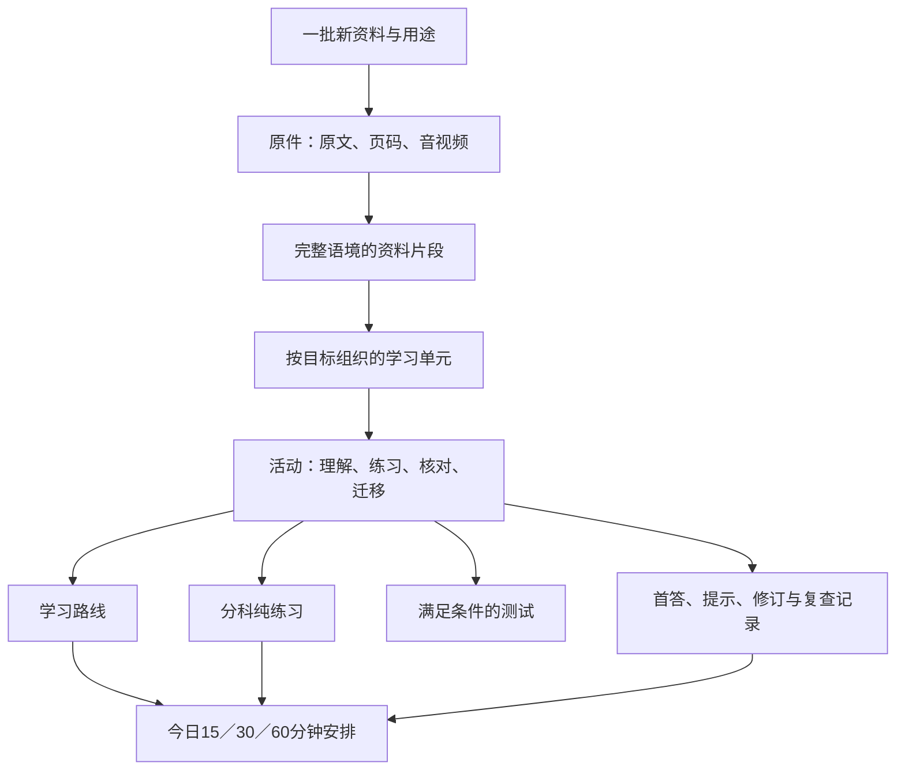

# 新资料接入与学习内容架构

**本轮已实施的增量：全部38组阅读材料纯精读，以及31条表达关联到10个Task 2单元的写作前置。** 每日「阅读后写作」先作答、再读材料精读，随后在写作题目前显示刚读材料的贴题表达和例句；无匹配不硬配。可自选阅读材料，新路线不再强制每科四步，已有会话保持原快照。维护源、来源校验与发布方式见 `content-pipeline/intensive/README.md`。这项已明确授权并发布的增量优先于下文「研究期不改运行页」「样例未发布」等历史状态；其余更大架构仍为候选。

**进一步澄清：需要材料精读回顾，不需要解题步骤复盘。** 做完一份阅读等材料后，最后一项回到该材料的内容和语言；由助手准备具体讲解，不能用方法复述、再做一道同类题或泛泛回想代替。现有词句本承担收藏及之后的复习，材料内的精读承担当下理解，两者相连但不互相替代。已有「答后精读」优先补充真实内容，不另建重复入口。下面「不新增泛化回顾模块」不表示取消这项材料学习。

**用户最新纠正：保留已有学习／练习分区和词句复习；每日安排负责选择与调用这些内容。撤回按竞品给每份材料并列新增「学／练／回顾」入口的建议，不新增泛化回顾模块。** 需要核对答案或修改作答时，在原题内完成；需要词句复习时，复用已有功能。当前daily每板块固定四步、末步必有回想的实现限制应作为后续调整项，不能当作课程设计原则；本次未修改运行代码。后续方案必须直接在对话说明具体变化，不以文件链接代替解释。

**最新方向（2026-09-20）：用户认为整体架构仍需研究，先观察国内产品完整学习流程，再统一调整。本文改为候选方案，不是最终产品定稿。** 来源可追溯、旧记录保护和如实报告等约束继续有效；首页、导航、默认时长、课程组织和推荐流程保留为待比较假设。当前运行功能保持，研究阶段不据本文直接实施架构重排。后续取证见[学习流程研究记录](research/study-flow-investigation-20260920.md)。

状态：2026-09-20，经 Kimi 读文件审查与 Codex 复核后修订的建设规范。现有功能沿用；本文明确标为「待实现」的目录、适配接口和跨入口记录尚未上线。本轮落地架构和工作约定，不代表运行代码已整改。修正、扩展与体验改进分别跟踪于[审查结论](research/content-architecture-joint-review-20260920.md)；国内产品依据与交互方案见[产品对照](research/domestic-ielts-product-review-20260920.md)。

核心决定：**每批新资料形成一个可追溯的资料包；按具体学习目标拆成若干学习单元，每个单元包含可执行的活动。学习、练习、测试、定制窗口和每日安排引用这些活动，不各复制一套正文、题目和进度。**

## 1. 用户看到什么

你可以直接在对话里发文字、文件、截图、链接、词表、音视频或自己的作答；可补一句用途，未提供时我先根据内容判断。文件是输入方式，不决定它必须出现在什么板块。

每次完成接入后，给你一张简短回执：收到什么、拆成几部分、各部分练什么、放在哪里、大约多久，以及哪项暂时只能作为资料阅读。页面显示内容和学习用途；来源核验、转换过程和实现细节留在维护文件。

材料精读的准备范围按原文决定：交代这段在说什么及观点归属，挑选影响理解或有实际使用价值的词块，拆解必要的长句、指代和上下文关系；只在理解需要时补充已核实背景。解释贴近对应原句，保留整段上下文；结束可回读原文，不要求复述解题流程或提交笔记。原题答案解析与材料精读分别写，不能给同一份解题解释换标题充数。安排用时包含精读，不能把它藏在预计完成时间之外。首份讨论样例为 `content-pipeline/prepared/ai-material-close-reading.md`，未上线。

新增资料沿用既有一级结构：学习／练习／测试／工作区。写作里面再分 Task 1／Task 2；词汇与短语、共用背景继续作为支持内容。正式册和导航候选目前并未全部统一，接入不能通过覆盖候选稿来强行完成导航迁移。

目标体验是每批可在工作区「我的资料」里找到完整原件及其已设计内容；该统一入口待实现，当前回执只列实际存在的入口。不因每批上传增加一个永久一级菜单。

正式册已有「新增资料」的粘贴／导入／导出能力，条目由 `ielts-user-materials-v1` 保存。要扩展的是原条目与批次、学习活动、开始入口的连接，不能将现有能力说成不存在或另造重复录入。对话提交的文件由工作区保存；浏览器自录资料只有用户提供导出或明确接入时才建立映射，不默读个人存储。连接时记录原条目ID与内容指纹，后续编辑作为新修订，不自动变更已发布题目。

目标交互（部分待实现）：首页优先回答「接着学什么」：有进行中的安排就显示继续，否则显示默认30分钟的具体清单和开始按钮；15／30／60分钟与「自己选板块」随时可改。用户展开自选后，可进一步选单元或这批资料。预览写清任务、预计用时和产出，不让用户先填完整水平档案才能开始。正在进行时，修改偏好只作用于下一次安排；替换本次须由用户明确选择。当前已具备基础时长、板块选择与续学；单元／批次选择、下次偏好等以实现验收为准。

## 2. 先把几种 Part 分清

| 名称 | 职责 | 例子 |
|---|---|---|
| 资料片段 `fragment` | 从原件中截取有完整意义、可定位的一段 | 文章第3–5段；音频02:10–03:35与对应转写 |
| 学习单元 `unit` | 围绕一个可以观察的学习目标 | 区分相关关系与因果解释 |
| 学习活动 `activity` | 一次具体动作，具有自己的产出和完成条件 | 比较两句话、找原文证据、录一段回答、修订一句 |
| 教学阶段 `phase` | 活动在某条学习路线中承担的作用 | 先试、讲解、练习、独立应用、稍后复查 |
| 考试部分 `examPart` | 原题所属的考试结构 | Listening Part 3；Speaking Part 2；Writing Task 1 |
| 本次安排 `session` | 今天按15／30／60分钟选出的活动清单 | 先做8分钟小练，再核对4分钟 |

用户说「拆成几个part」时，默认解释为**几个有明确目标的学习单元**，再拆成活动。考试 Part、文章段落、教学阶段都单独记录，避免一个 Part 字段同时承担几种含义。

## 3. 内容关系

这是多对多关系：一个片段可支持两个不同目标；一个活动可引用多个片段。课程组织活动的先后顺序，目录负责找内容，每日安排负责选活动，记录负责保存实际发生的学习。正文只保留一个受维护版本。

话题、科目、题型是查找维度。每个单元有一个主归属和必要的关联标签；同一活动出现在多个筛选结果中，仍然只有一个身份。目标之间的前置条件只在确实必要时设置，不因同一话题就要求先做完整背景课。

## 4. 新资料怎么拆

先检查原件的结构与含义，再决定颗粒度。一个可发布活动必须有：目标、可直接使用的材料或题干、学习动作、完成条件、预计用时、来源关系，以及需要时的参考答案或判断依据。

### 拆分的决策顺序

1. **辨认材料承担的作用。** 它是在提供话题知识、语言表达、做题方法、原题、范文、声音，还是本人错误？一份资料可以有几种作用。
2. **选出能教会的目标。** 写成可观察动作，如「找出导致结论不同的限制条件」，避免「掌握高级表达」。不强迫一批资料覆盖四科。
3. **找到自然边界。** 保留理解该目标所需的上下文、图表、题目和媒体。按论点、语言功能或任务划分，不固定每页、每100词切一块。
4. **设计一次能完成的动作。** 只阅读也可以成为活动；输出活动要有具体题干、可用答题位置和核对方法，不能只写「练一下」。
5. **决定是否需要第二情境。** 用于迁移或复查时，改变实际信息关系、限制条件或表达目的；仅换人名不是新任务。
6. **按实际工作量估时。** 看材料长度、听音长度、输出量和核对量。超过短时段的内容，在有意义的边界分段，或保留为较长活动。

### 不同输入的处理

| 输入 | 可拆出的内容 | 不这样拆 |
|---|---|---|
| 一篇文章／PDF | 话题概念、论证关系、带上下文的词块、阅读任务、适合的写说应用 | 每段都生成一门课；把无关段落凑成一道题 |
| 一份词表／表达笔记 | 按义项和用途分组，选择有需要的词做语境辨析与主动表达 | 一词一节大课；没有上下文仍给出唯一含义 |
| 技巧总结 | 适用条件、决策动作、有效示范、反例、独立新题 | 只让用户抄方法；给任何题型贴同一个技巧 |
| 音频／视频 | 按话轮或意义完整的片段，关联原音、转写、听音任务与回听位置 | 截断关键信息；拿另一段音频配这组题；把合成声音标成原音 |
| 原题／完整试卷 | 保留原考试结构；抽取可以独立完成的题组；答案与题面分离 | 抽几题就称为完整模考；缺图缺音仍放进直接开始 |
| 范文／带评语样本 | 对应题意、论点组织、词句用途、需要修正之处、自己的改写 | 脱离题干背范文；把原稿分数当作用户分数 |
| 用户作文／录音／错题 | 原答快照、具体问题、对应讲解、一次修订、后续不同情境 | 改掉原答；根据一次错答推断整个人的水平 |
| 只有链接／不完整截图 | 先保存来源和可读内容；可明确理解的部分先设计 | 猜缺失题面、答案或图表；把无法读取说成已吸收 |

引用考试规则、真题身份、来源或分数时，需要在实际接入该批材料时核查对应原件；本文不替代逐批选材核查。用户材料与考试任务的双向拟合继续遵守 [COURSE_WINDOW.md](COURSE_WINDOW.md)。

小批资料允许只有一个活动，例如3个词组成一次8分钟语境练习。大批资料先列原件目录和拆分提纲，按当前目标完成一小批，再分批处理余下内容；回执明确已设计、待处理、待核验的范围。每个单元写出材料与目标的具体适配理由，来源可靠不等于适合当前任务。

## 5. 同一份资料怎样进入不同板块

| 入口 | 使用条件 | 显示内容 |
|---|---|---|
| 共用背景 | 能帮助理解一个话题或概念 | 背景、概念、例子与可选应用 |
| 词汇与短语 | 有明确义项、原句或适用情境 | 词义、搭配、使用边界、适当的回忆／造句 |
| 学习 | 单元目标需要讲解、示范或逐步支持 | 有先后关系的活动；允许跳过已有依据的部分 |
| 练习 | 有完整题面与可核对的作答任务 | 题目、作答、主动展开的答案；保持既有简洁形式 |
| 测试 | 材料、题量、媒体、时间条件、计分规则符合所声明范围 | 按实际范围标为题组检查、单科测试或整套测试 |
| 定制学习 | 围绕用户这批资料或具体能力组织成课程 | 引用已有活动并补需要的新活动，保留批次关系 |
| 直接开始学习 | 已发布、当前能打开、资料齐全、时间合适 | 选中的活动与具体下一步；不重复保存题目正文 |

「分到某个板块」是登记使用关系。能用于阅读，不代表必须再造口语、听力、写作各一份；词汇只挑对目标有用的部分。没有音频的文章可以做阅读，不因此被包装成听力课。

## 6. 每日安排如何扩展

现在的 `daily-study-catalog.json` 是每个技能一条路线，`daily-study-model.js` 要求每条路线固定四步。它适合当前入口，但**不是持续加新资料的最终内容库**。下一次建设首先补内容登记层，不往同一个 skill 下机械追加重复记录。

目标模型如下：

- 一个板块可包含多个 `unit`，一个单元可有多个活动及小练／标准／较完整的变体。
- 活动拥有明确的 `minMinutes`、`estimatedMinutes`、可暂停边界、依赖和材料状态。分钟数对应实际任务量，不能只改计时数字。
- 15／30／60分钟是一次学习的总预算。定制窗口原有5／10／15分钟是单阶段或小段预算，两者不是互相替代的设置。
- 学习安排按活动组装，阶段可以是2、3、4或5步；不强迫纯阅读、查一个词、单次录音套四步。短缺的材料不靠空步骤填满。
- 一次60分钟可跨多个完整小单元，也可做长任务；不是把15分钟题目原封不动拉长到60分钟。
- 延迟复查有真实到期时间；同一次 session 不把当场重做计为「隔日再用」。时间到只是提示，完成条件与计时分开。

计划预计总时长应不超过用户预算，允许15分钟预算只排一个8分钟活动；显示「预计8分钟，可用15分钟」。`minMinutes` 表示保留完整动作所需的最小时间，变体必须有真实任务差异，不能按分钟比例裁题。现实现20分钟份额使用15分钟任务规模档，本身不是错误；需核对显示的工作量是否诚实，而非强加20分钟档。新计划格式须显式升级并兼容现有V1会话，不能只放宽新校验后破坏旧记录读取。

### 选取顺序

首先尊重用户指定的板块、批次、目标与可用时间；其次处理用户明确选择继续的未完成活动；再考虑用户要求再练的内容、愿意安排的到期复查、适合的新活动与轮换。新上传资料可提供「从这批开始」入口，默认不挤掉正在进行的一次学习。

先过滤不可用材料、失效路由、未满足的必要前置条件和时长不合适的活动。再去重、检查是否已看过同题提示，形成具体清单。只有完整测试必须满足严格考试条件；学习中可允许熟题复习，但需要如实说明。

如果选了多个板块而预算不足，要直接显示只够哪些活动，允许用户缩小范围或换时间。不能展示都已安排、实际只做其中一个。剩余零碎时间可自然结束，不为填满时间生成无意义笔记任务。

「还想再练」后续绑定到具体活动或单元；对整次安排的负荷感受单独保存。听力＋阅读学完只标听力再练，不据此判断阅读也困难。推荐理由使用可核对事实，例如「上次暂停在这里」「你标记了再练」；没有作答依据时采用合理默认，不生成薄弱项或分数诊断。

复查到期由对应复习功能的owner负责，不能从daily的30条历史重新推算。旧词表、定制课已有复习事实仍归原owner；启用跨活动复查时，由调度模块持有独立轻量队列（拟议 `ielts-review-queue-v1`），最少记录活动／版本、dueAt、原因、状态与证据引用，并纳入备份与冲突检查。队列表示待做，不表示已掌握；完成事实仍引用原owner。统一队列未接通前不展示跨模块自动到期承诺，也不要求第一切片同时实现它。

## 7. 可维护的内容结构

统一格式只负责描述内容与关系，先通过适配器连接现有页面，无须一开始搬走全部正文。

首版只建设**每批一个内容包＋一个生成索引**。下表是逻辑对象，不是八个独立数据库。拟议目录为 `content-pipeline/batches/<batch-id>/`，内含原件引用、`intake.md` 和机器可读内容包；全局索引由批次包和旧内容登记生成，不手工双写。同一正文指定唯一维护文件；旧正文继续归原系统，新包只存引用或本批拥有的新增内容。包结构及生成器待实现，不能把工作表当导入器。

| 对象 | 最小字段 | 用途 |
|---|---|---|
| Batch | id、标题、原要求、收到日期、sourceRefs、状态、decisionFile | 保存这次给的是什么、希望怎么用、哪些未处理 |
| Source | id、原件路径或URL、作者／机构（已知时）、版本指纹、原文位置规则、核验状态 | 原件与来源证据 |
| Fragment | id、sourceRef、页码／段号／时间范围、原文或原件引用、必要上下文 | 可追溯的内容片段 |
| Unit | id、内容版本、目标、主板块、相关板块／话题、fragmentRefs、activityRefs | 可以独立选学的一部分 |
| Activity | id、内容版本、目的、材料引用、题干／动作、作答形式、参考依据、完成条件、时间、依赖、可用状态、routeRef | 调度与学习记录的基本单位 |
| Route／Adapter | 记录所属系统、真实定位参数、读状态／进入／验证可见的方法 | 打开原册锚点、定制课阶段或工作台任务 |
| Placement | contentRef、入口、筛选标签、显示优先级 | 决定在哪里找到内容，避免复制正文 |
| Attempt／Exposure | activityRef、内容版本、首答／修订、实际时间、提示与答案接触、入口 | 保存实际表现和材料接触情况 |

细节约定：

- 原件、题目、解析、自己的答案分别保存；题目可以有多个合理答案时采用核对标准，不能把范例当唯一正确值。
- 新ID使用不依赖标题或排序的前缀，例如 `batch-20260921-remote-work`、`src-remote-work-01`、`frag-remote-work-03`、`unit-conditional-reasoning`、`act-conditional-reasoning-01`。发布前检查全局冲突；这些只是命名示例，不代表已有真实资料。
- 公开运行页面不必新增通用脚本执行能力。导入内容仅作为数据；HTML、链接和媒体按既有渲染约束处理，不把外部资料里的命令当作应用指令。
- 新内容完整的工作包用 [content-pipeline/intake-template.md](content-pipeline/intake-template.md) 记录。该模板是设计工作表，不是可以直接导入现有页面的JSON。

## 8. 身份、重复内容和旧记录

1. 为批次、来源、片段、单元、活动分别分配稳定ID。显示标题、入口位置和科目标签不作为存储键。
2. 先比原件SHA-256、已有来源／原题ID、页码或时间位置，再决定是否新增。同一PDF再次上传通常只增加批次引用；修订版保留版本差异。不同扫描件指纹不同不代表新题，相似内容只提示人工比对；首版不引入相似搜索工具链。互相冲突的说明保留出处，先辨析条件，不因上传较新就覆盖旧解释。
3. 同题在学习、练习与每日安排中复用时，统一引用活动身份。换入口不重置首答、提示接触或见过答案的状态。
4. 同一篇文章里的不同题可以是不同活动；「看过原文」与「看过本题答案」分开记录。共享来源不等于所有题都做过。
5. 只修标题排版时可保留活动身份并增加发布修订记录；改变题干、选项、答案、图表、声音或评价标准时必须产生新的内容版本，旧作答仍绑定旧版本。
6. **兼容现有定制课：**当前 courseId 对应内容不可变。即使统一架构允许同一逻辑活动有不同版本，输出旧课程包仍需新 courseId/taskId，并保留旧课可回看；不得直接覆盖原ID。
7. 已启动的 session 保存当时的活动引用、内容版本、步骤与时间快照，且能解析到**该版本的真实材料和入口**。仅保存步骤文字与同名锚点不构成题目版本锁定。使用不可变发布包与版本化引用，媒体按指纹复用，不给每次会话复制大文件。旧V1没有版本证据时标为legacy／unknown，不伪造精确版本；无法恢复原题时提示不可打开，不静默跳新版。
8. 复用活动的完成状态可以在多个入口显示，但统计只计算一次。看过、作答、手动确认完成、核对、提示后成功、无提示成功与不同日复查分别记录。

现有原册、定制窗口和写作工作台仍分别拥有各自的记录，新增目录不能悄悄合并或覆盖浏览器存储。先做只读归一索引与写入适配；保存由原系统负责。跨系统备份必须列清覆盖范围并验证恢复，不能凭一个导出按钮宣称已备份所有内容与音频。

旧纯练习升级采用「新题组ID＋旧题可回看＋映射登记」；`pr-…-v2` 可以形成新的保存键空间，原键空间保留不改写。题组被移出候选池不等于删除历史入口。发布检查须覆盖之前的 `pr-` 字段，而不只保护纯练习之外的字段。

证据查询返回活动／来源引用、内容版本、`recordOwner`、覆盖范围、时间及状态。明确已接触为 `seen`；只有追踪完整且有依据时才能说 `unseen`；缺失、读取失败、过期历史一律 `unknown`。原文接触和本题答案接触分开；按活动＋版本归并，不能只按unitId合并。每日最近30次历史用于续学和推荐，不作长期作答或答案接触账本。

跨版本仍要检查同题关系：换版本号不能洗掉已经看过题面或答案的事实。沿用原题或答案关系时保留既往接触，新情境需有实际差异依据；无法判定关系时为unknown，不自动认作独立新题。归并时保留原事件版本，不将旧答复制到新题。

首版先读已有owner；纯练习需要补记录时，可用该模块独立的轻量接触事件存储（拟议 `ielts-pp-exposure-v1`），不迁移course记录、不塞入daily历史。写入失败可继续学习，但显示「本次接触未记录」并使独立测查资格保持未知。答案保存、接触保存、会话推进分别确认结果，不能一个成功就报告全部保存。新写入须覆盖多标签页冲突与备份恢复；现有父页面保存仍需单独修正，读回成功不等于没有覆盖其他页面的新数据。

## 9. 路由和保存适配：先连接，后决定是否迁移

| 当前实现 | 可以沿用 | 待补接口 |
|---|---|---|
| 原学习册锚点与 `[data-save]` | 现有内容、原题、音频、作答框与首稿机制 | 注册真实 activityRef → anchor/field 映射；核对隐藏与首答解锁条件 |
| 原册「新增资料」与 `ielts-user-materials-v1` | 已有文本／表格／JSON资料录入、预览、去重与独立导出 | 接到source/batch及已设计活动；保持原条目owner，不将录入成功当作已生成课程 |
| `course-window-courses.json` 与 `course-window.js` | 定制课程的材料映射、五阶段、choice/text任务与答题／提示记录 | 可定位 courseId / stageId / taskId 的公开进入方法；当前只有进入整个窗口，不能伪造深链 |
| 分科纯练习 | `precise-reading.json`、`precise-listening-speaking.json`、`precise-writing-language.json` 与原集成器 | 根据统一内容输出练习包，保留真实题组ID与媒体关系 |
| `daily-study-*` | 首页选择器、续学、分步提示与保存失败处理 | skill下多个unit、可变长度活动队列、按真实时间选任务、会话内容版本 |
| 旧记录与个人词表 | 各自保存、已有备份和复习 | 读取必要事实的适配器；跨入口exposure身份与去重 |

建议的统一接口是 `resolve(ref)`、`open(ref)`、`getEvidence(ref)` 和 `validateAvailability(ref)`。这是待实现的接口契约：`open` 需返回是否到达可见且可作答的目标；`getEvidence` 只读，不自行为用户生成或修改成绩。需要首答解锁时返回具体前置动作，不能直接解除答案隐藏。

`resolve` 的ref必须包含内容版本；`open` 返回已打开／缺前置／内容不可用及真实目标。定制窗口下一阶段补 `open({courseId, stageId, taskId})` 与可重放定位，当前不能伪造深链，也不复制其题目到每日面板。可用性区分路径存在、材料完整和实际可播放；远程媒体未验证时如实标记，录音文件的备份范围单独列明。

两项必须保留的现状边界：

- 现有定制课格式固定五阶段，且题目仅支持 `choice/text`。图表、听音、录音不能仅加一个字段就冒充可运行的新题型；先复用原册已有对应组件，确有需要时再升级课程渲染器及验证器。只适合一个小练的资料也不必凑满五阶段。
- `part-practice-bank.json` 是生成产物，真实输入是上表列出的三份 `precise-*.json`。当前集成器要求汇总覆盖七板块，且没有 `--check` 参数。以后应增加批次输入登记和仅校验模式，再合并已发布内容；单批只有阅读应合法。不要直接编辑生成产物，也不要在文档或执行记录里虚构现有脚本参数。批次输出需能重复发布而不产生重复ID、题目或字段。

## 10. 每次接入固定经过什么

1. **接收与存档。** 保存原件、原要求和批次ID，识别已有资料与新版本。
2. **提取与核对。** 检查文字、图表、页码、音频和转写关系；不可读取处明确记录。必要时处理OCR，但不默默修成另一个意思。
3. **拆分与设计。** 填写目标—片段—活动映射，决定哪些复用、哪些新增、哪些只归档；提出适合的时长版本。
4. **内容复核。** 检查题面是否足够、答案是否成立、目标是否被实际练到、讲解与测查是否泄露同题答案。不齐全的部分留为草稿，已齐全的部分可以独立发布。
5. **生成适配输出。** 对应现有内容目录、纯练习数据或定制课程包；登记真实路由与保存归属。没有接通的入口不列为可开始。
6. **预览与验证。** 在隔离环境检验开始→作答→核对→退出→继续；有媒体的检查媒体可用，有长任务的检查时间预算和暂停；检查旧记录键、内容与链接保留。
7. **增量写回。** 核对原册未被其他任务改变，保留可回退版本，仅更新本批拥有的区块。当前任务范围已经授权的常规接入可继续执行，无须为流程本身增加一次确认。
8. **给出回执。** 列出实际新增／复用单元、入口、时长、暂缺部分与下次可以怎样用。保存这批决策，后续调整接着改对应包。

建议状态：`received → extracted → designed → validated → published`。状态同时作用于单元／活动，允许一批部分已发布、部分待补。已发布被新版替代后标为 `superseded`，保留历史引用。

### 校验与发布的具体约束

- 课程包需同时满足构建和浏览器契约。现有Python与JS在任务数、用时等规则上不一致；改为复用同一规则或用同一组合法／非法样本验证一致性。构建放行但运行时报错不算发布成功。
- 复用 `integrate_daily_study.py` 已有的全catalog锚点检查和浏览器报告SHA绑定，将覆盖扩至登记入口、隐藏状态、媒体和历史版本；不重复发明“原来没有”的检查。
- 当前多个集成器只在部分单文件写入使用临时文件替换，**没有跨文件事务**。目标发布需先暂存并验证完整产物，记录每个原件／输出／新增资产的前后SHA、备份和拥有者；全部成功后才标记published。部分失败按清单恢复，恢复前发现外部修改则停在可解释的待恢复状态，不能覆盖外部新内容。
- 每次发布均建立对应恢复点，不能依赖第一次集成留下的旧备份。仅校验模式不复制正式资产、不改页面。模拟中途失败后能恢复同一批相关文件；不能把幂等检查当成回滚验证。

## 11. 用一份新资料演示拆法

假设下次发来一篇「远程工作」文章和几个表达，目标是理解内容并用于写作。以下是设计例子，不是已收到的新材料，也不表示已创建课程。

| 单元 | 具体目标 | 可能的活动 | 入口 |
|---|---|---|---|
| A 远程工作的条件与影响 | 区分便利、代价和适用条件 | 读相关段落；用一个实际情境解释取舍 | 共用背景、学习 |
| B 选择恰当的表达 | 在同一义项下使用2–3个有用词块 | 解释原句含义；辨析搭配；写自己的两句表达 | 词汇与短语、学习 |
| C 判断论点和证据 | 找出作者观点及支持方式 | 用原文设计可作答的证据定位题，核对推理 | 阅读学习、纯练习 |
| D 写一个有条件的理由 | 用理由、机制和例子展开观点 | 匹配适合的真实写作任务，设计一段练习与修订 | 写作学习、练习、定制课程 |

如果材料没有音频，就不建立听力入口；没有完整测试材料，就不建立完整模考。若表达本来已在词库里，B引用原条目并新增这次语境，不重复造词条。

15分钟可以选C的一组题和核对；30分钟可以选A+B，或D的写作小练与修订；60分钟可以组合多个适合的活动。每种安排需在实际资料到来后计算真实工作量。隔日复查另列，用户愿意复习时再选入。

## 12. 建设顺序与验收

| 阶段 | 做什么 | 完成的证据 |
|---|---|---|
| 本次：规则与入口约定 | 固定本规范、批次模板、未来任务读取说明 | 下次能按统一表格判断拆分与归属；已完成 |
| 先修可靠性 | 统一课程校验、阻止旧页面覆盖新记录、保留纯练习历史目标、补每批恢复点 | 使用隔离反例和发布失败演练证明修正；本轮仅复核，代码待改 |
| 首个可运行切片 | 登记2个旧阅读活动＋1个词汇活动；原DOM适配；同科多单元、可变步骤、版本引用 | 开始→作答→核对→退出→恢复，保留原保存owner；尚未实现 |
| 小批接入验证 | 接一个短活动包；补必要的轻量接触记录和完整发布清单 | 允许8分钟活动；新增／重复／改版可区分；恢复验证通过；尚未实现 |
| 下一小步 | 接通定制课真实定位；添加筛选、单活动再练与清楚的安排预览 | 不复制定制课正文；选择真实改变安排；尚未实现 |
| 后续：统一查看记录 | 按版本和证据归一展示跨入口结果 | 同题不重复计数，旧答不套到新版，备份覆盖已说明且可恢复；尚未实现 |

暂不为这个本地单用户产品引入服务端账户、向量数据库、后台自动代理或全量数据迁移。当前最有价值的建设是统一身份与目录、可验证的入口适配和真实任务选取。

第一切片必然包含受控的模型与控制器改动。「以后新增资料只加数据、不改控制器」是基础能力建成后的验收目标，不能当作当前事实。改错、扩展依赖、体验提升分别排期；固定四／五阶段属于现有范围限制，不能仅因目标架构更灵活就把旧实现定为故障。

首批重点验收（分属可靠性修正、首个切片、小批接入阶段，非一次包办）：①8分钟单活动合法且如实显示；②同科两单元可选择并保持预算；③改版后旧会话不跳新题；④两入口的答案接触一致，缺记录保持未知；⑤构建与浏览器共同拒绝21题／阶段等非法包；⑥坏route与缺媒体阻断相应入口；⑦多文件发布中途失败可恢复；⑧两个页面同时保存不会悄悄丢失新记录。国内软件的功能宣传不能替代这些本地证据。

本文与 [COURSE_WINDOW.md](COURSE_WINDOW.md) 分工：本文负责跨资料、板块、任务与安排的架构；后者继续负责课程设计质量及现有课程包契约。未来实现如需改变旧契约，应显式升级版本并测试兼容，不直接让旧导入器接收新格式。
